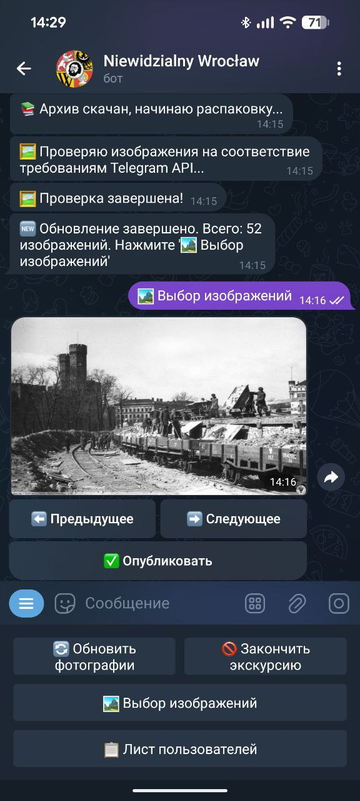
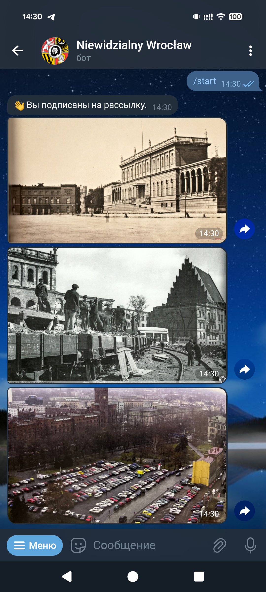
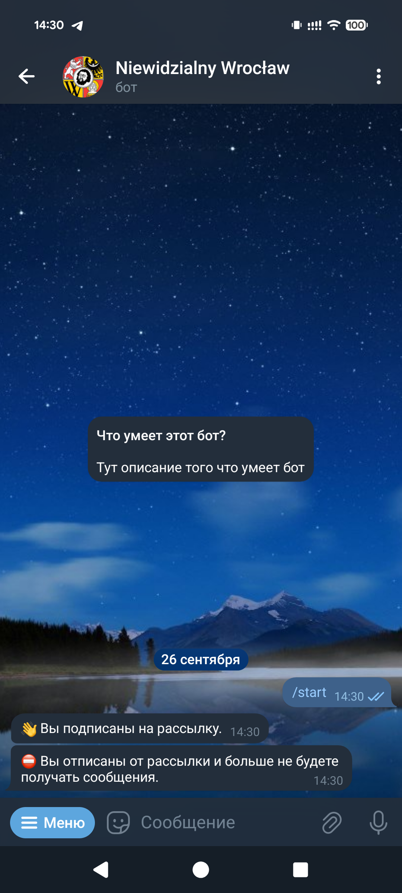

# Invisible Wrocław Bot

## Description

This project is a Telegram bot designed to showcase photos of Wrocław. It allows administrators to update the photo collection from a Google Drive archive and publish them to subscribed users, and remove all posts if needed



<p>And participants panel:</p>

<div style="display: flex; gap: 10px; align-items: flex-start;">
  
  
</div>


## Prerequisites

- Python 3.12
- [uv](https://github.com/astral-sh/uv) package manager
- Telegram Bot token (obtained from BotFather)

## Setup

1.  **Clone the repository:**

    ```bash
    git clone <repository_url>
    cd invisible-wroclaw
    ```

2.  **Install dependencies:**

    Using uv:

    ```bash
    uv sync
    source .venv/bin/activate
    ```

    Alternatively, using pip:

    ```bash
    python3 -m venv .venv
    source .venv/bin/activate
    pip install -r .
    ```

3.  **Configuration:**

    *   Create a `.env` file in the project root directory.
    *   Add your Telegram bot token to the `.env` file:

        ```
        TELEGRAM_TOKEN=YOUR_TELEGRAM_BOT_TOKEN
        ```

    *   Configure `settings.yaml` file:

        *   `images_archive`: Google Drive folder URL containing the images archive.
        *   `images_name`: Name of the images archive file.
        *   `images_dir`: Directory to store extracted images.
        *   `database`: Path to the SQLite database file.
        *   `admins`: List of Telegram usernames or user IDs with administrative privileges.

## Running the Bot

1.  **Start the bot:**

    Open Telegram and search for your bot.
    Send the /start command to the bot.
    Admin Commands:

    Admins can use the control panel to:
    Refresh photos from Google Drive.
    Control and publish photos to users.
    Purge all users and messages.
    Project Structure

```bash
python [main.py]
```
